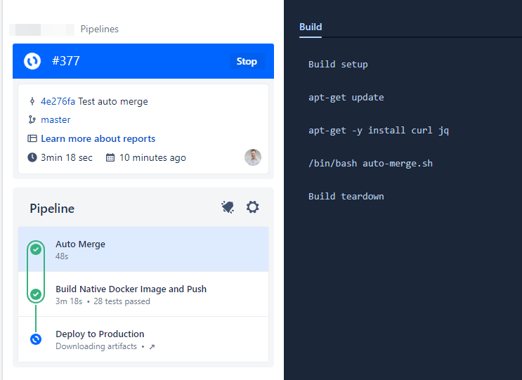
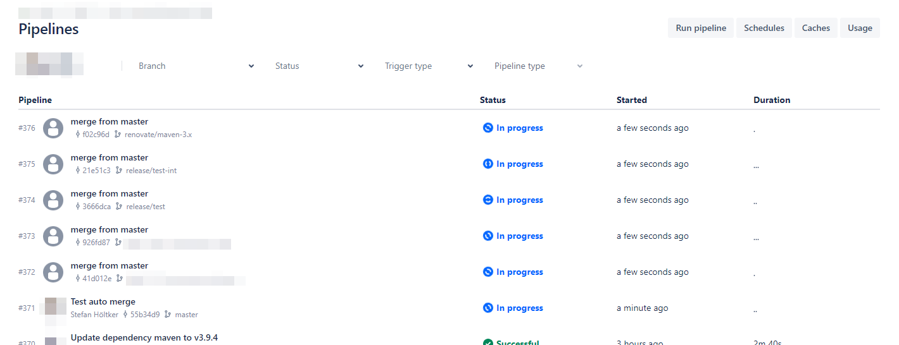
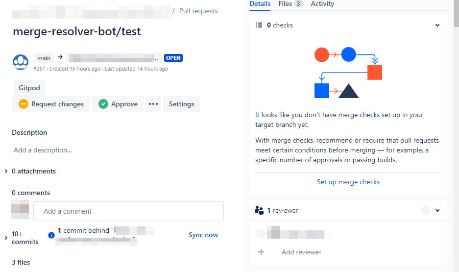

# bitbucket-auto-merge

## What is does 

Since there is no such feature for automatic branch merging in bitbucket cloud [BCLOUD-14286](https://jira.atlassian.com/browse/BCLOUD-14286), i decided to script it myself.

The Script `auto-merge.sh` uses git and plain Shell commands and also the bitbucket cloud api.

In order to get it working, you need to create a OAuth Consumer see below.

## Setup

1. Copy the `auto-merge.sh` to the root of your repository
2. If you dont have a `bitbucket-pipelines.yml` already create one (you can use the demo file from this repo)
3. Setup the OAuth Consumer [See here for example](https://dev.to/clickpesa/automating-pull-request-creation-from-one-branch-to-another-using-javascript-bitbucket-pipelines-and-bitbucket-api-3ijh)
4. If you have workspace Admin rights go to workspace → settings → OAuth Consumers → Add consumer
5. Fill in required information, especially the name and give your new consumer permissions for different operations but in our case we’ll give permission to read and write pull requests. Make sure to check the This is a private consumer checkbox and a callback url (you can add any url).
6. After saving the consumer, click the consumer to view the key and secret
7. Create a variable (on workspace or repository level) with name BB_AUTH_STRING and the values should be added as key:value for instance VzW7ubArG8T3huEDXs:eRNqGCycMVPvfzsGhEyd7xP33tYLd2jZ, this variable should be secured. Now we can use this value as a variable in the pipeline to authenticate users.

## How it does it

1. In the `bitbucket-pipelines.yml` Auto Merge Step definition, it defines to clone the full repo
2. Install `curl` and `jq` in order to work and starts the `auto-mege.sh` Script located int the repository itself
3. The `auto-mege.sh` Script checksout the main/master branch and gets all existing branches
4. Then it iterates over all branches
5. and checks with `git log` if the branch is ahead and behind at least one commit
6. then tries to merge main into the branch without commit and checks if there where any merge conflicts
7. if no merge conflicts -> commit and pushes the changes
8. if merge conflicts -> Create PR with branch author as reviewer

## Demo

# Links

- https://jswenski.medium.com/nearly-automatic-branch-merging-with-bitbucket-cloud-5d34f41b0311
- https://dev.to/clickpesa/automating-pull-request-creation-from-one-branch-to-another-using-javascript-bitbucket-pipelines-and-bitbucket-api-3ijh
- https://jira.atlassian.com/browse/BCLOUD-14286

